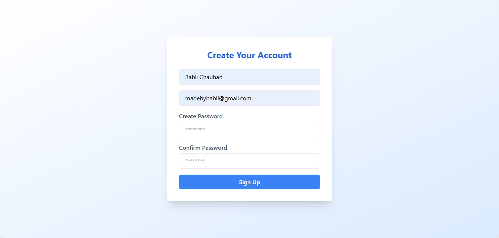
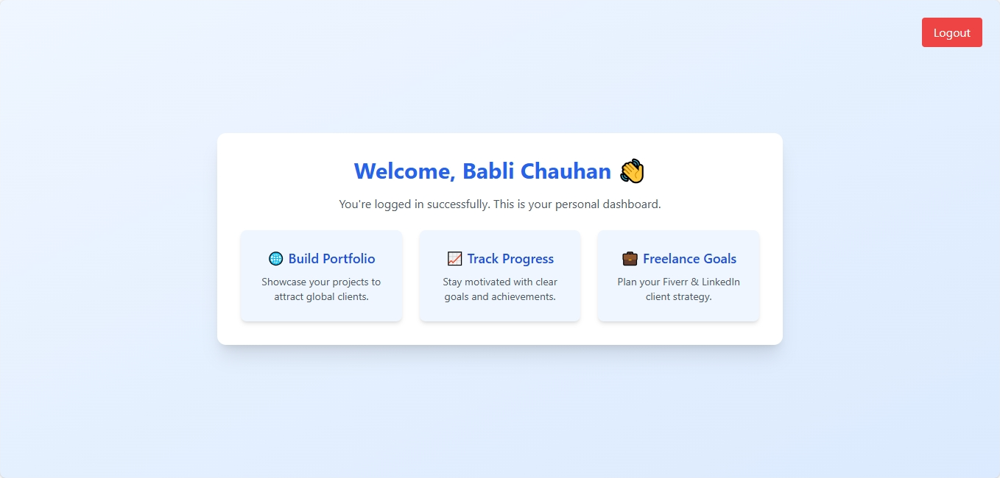

# 🔐 Modern Login & Signup UI – MadebyBabli

A sleek, animated, and responsive Login/Signup user interface built using *React, **Tailwind CSS, **Framer Motion, and **localStorage* – designed to impress clients and make a strong first impression.

---

## 🚀 Features

- 🔑 User Signup & Login functionality
- 🧠 Validations for email, password, and confirm password
- 🗂 User data stored securely in localStorage
- 🔒 Protected Dashboard route
- ✨ Smooth animations using Framer Motion
- 📱 Fully responsive design
- ✅ Toast notifications on actions (optional if added)

---

## 💻 Technologies Used

- React
- Tailwind CSS
- React Router DOM
- Framer Motion
- localStorage (for session logic)
- Vite (for fast development)

---

## 📸 Screenshots

| Login Page | Signup Page | Dashboard |
|------------|-------------|-----------|
|  |  |  |

---

## 🔗 Live Demo
*Netlify Link*: [https://your-deployed-link.netlify.app](https://madebybabli-login-signup.netlify.app)

---

## 🧠 How It Works

1. Signup stores user info in localStorage
2. Login checks credentials against saved data
3. On successful login, redirects to a protected Dashboard
4. Logout clears session from storage

---

## 📁 Folder Structure

📦 password_manager │   ├── favicon.ico │   └── index.html │ ├── 📁 src/ │   ├── 📁 components/ │   │   ├── Navbar.jsx │   │   └── ... (reusable UI components if any) │   │ │   ├── 📁 pages/ │   │   ├── Login.jsx │   │   ├── Signup.jsx │   │   ├── Dashboard.jsx │   │   └── Home.jsx │   │ │   ├── 📁 routes/ │   │   └── ProtectedRoute.jsx │   │ │   ├── App.jsx │   ├── main.jsx │   └── index.css │ ├── 📄 package.json ├── 📄 tailwind.config.js ├── 📄 postcss.config.js ├── 📄 vite.config.js └── 📄 .gitignore

---

## ✍ Author

*MadebyBabli*  
💼 LinkedIn: [linkedin.com/in/yourprofile](https://linkedin.com/in/yourprofile)  
📮 Email: madebybabli@gmail.com  
🌐 Portfolio: [madebybabli.netlify.app](https://madebybabli.netlify.app)

---

## ⭐ Show Your Support

If you like this project, drop a ⭐ on the repo or share it with others!